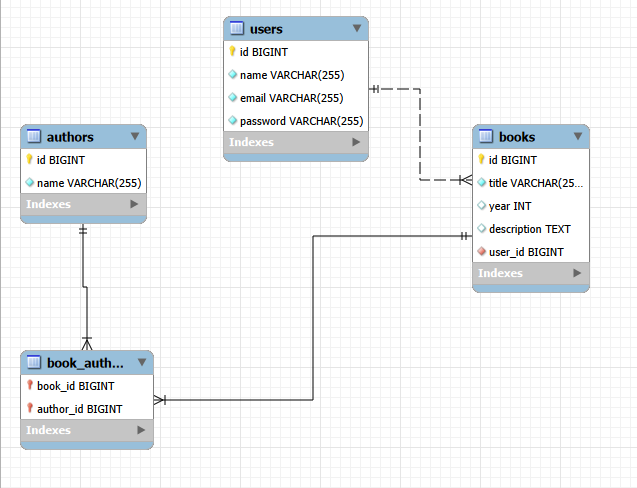

# Book Manager — Backend

API REST para gerenciamento de livros e autores, desenvolvida com **Java + Spring Boot**, utilizando **MySQL**, **Liquibase**, **JWT** e **Docker**.

A aplicação permite que usuários autenticados gerenciem sua própria coleção de livros.

🔗 **API em produção:** https://book-manager-backend-2t5a.onrender.com
📚 **[Abrir Swagger](https://book-manager-backend-2t5a.onrender.com/swagger-ui/index.html)**

> **Ambiente de produção:** a API está hospedada no plano gratuito do Render. Após um período sem utilização, o serviço pode entrar em *standby*. Nesse caso, a primeira requisição pode levar alguns segundos para inicializar a aplicação. Depois disso, a API funciona normalmente.
>
> A URL da API em produção pode ser utilizada diretamente no **Postman** para testar os endpoints.

---


## Funcionalidades

* Cadastro e autenticação de usuários com JWT
* CRUD de autores
* CRUD de livros
* Associação de múltiplos autores aos livros
* Paginação e busca de livros por título
* Isolamento dos livros por usuário autenticado
* Validação dos dados de entrada
* Tratamento global de exceções
* Migrations do banco com Liquibase
* Documentação da API com Swagger/OpenAPI

---

## Tecnologias

* Java 21
* Spring Boot 4.1
* Spring Security
* Spring Data JPA / Hibernate
* JWT
* Liquibase
* MySQL 8.4
* Maven
* Lombok
* Bean Validation
* Swagger / OpenAPI
* Docker / Docker Compose

---

## Pré-requisitos

### Com Docker

* Docker Desktop
* Docker Compose v2

### Sem Docker

* Java 21
* MySQL 8.4

O Maven Wrapper já está incluído no projeto.

---

## Configuração

Para executar com Docker, copie o arquivo de exemplo:

```bash
cp .env.example .env
```

Exemplo:

```env
SPRING_DATASOURCE_URL=jdbc:mysql://mysql:3306/bookmanager
SPRING_DATASOURCE_USERNAME=root
SPRING_DATASOURCE_PASSWORD=Teste123**

MYSQL_ROOT_PASSWORD=Teste123**

JWT_SECRET=minha-secreta-para-o-desafio-book-manager
```

> O arquivo `.env` não deve ser versionado. Utilize o `.env.example` como referência.

Para execução local sem Docker, o `application.properties` possui valores padrão para o MySQL local:

```text
jdbc:mysql://localhost:3306/bookmanager
```

---

## Executando com Docker

Na raiz do projeto:

```bash
docker compose up --build
```

A aplicação estará disponível em:

```text
http://localhost:8080
```

Para parar os containers:

```bash
docker compose down
```

Para remover também os dados do banco:

```bash
docker compose down -v
```

---

## Executando localmente

Crie o banco no MySQL:

```sql
CREATE DATABASE bookmanager;
```

Execute a aplicação com o Maven Wrapper.

### Windows - PowerShell

```bash
.\mvnw.cmd spring-boot:run
```

### Linux/macOS

```bash
./mvnw spring-boot:run
```

A API estará disponível em:

```text
http://localhost:8080
```

As migrations do Liquibase são executadas automaticamente durante a inicialização.

---

## Banco de Dados

O schema do banco é gerenciado pelo **Liquibase**.

O Hibernate está configurado com:

```properties
spring.jpa.hibernate.ddl-auto=validate
```

Dessa forma, o Hibernate apenas valida o schema, enquanto a criação e evolução das tabelas são responsabilidade do Liquibase.

### Diagrama



---

## Autenticação

A API utiliza **JWT** para autenticação.

O fluxo básico é:

```text
POST /auth/register
        ↓
POST /auth/login
        ↓
JWT Token
        ↓
Authorization: Bearer <token>
```

Os endpoints de autenticação são públicos. Os demais endpoints exigem um token JWT válido.

Os livros são associados ao usuário autenticado, garantindo que cada usuário possa acessar e gerenciar apenas seus próprios livros.

---

## Principais Endpoints

### Autenticação

| Método | Endpoint         | Descrição                     |
| ------ | ---------------- | ----------------------------- |
| POST   | `/auth/register` | Cadastro de usuário           |
| POST   | `/auth/login`    | Autenticação e geração do JWT |

### Autores

| Método | Endpoint        | Descrição       |
| ------ | --------------- | --------------- |
| POST   | `/authors`      | Criar autor     |
| GET    | `/authors`      | Listar autores  |
| GET    | `/authors/{id}` | Buscar autor    |
| PUT    | `/authors/{id}` | Atualizar autor |
| DELETE | `/authors/{id}` | Excluir autor   |

### Livros

| Método | Endpoint        | Descrição               |
| ------ | --------------- | ----------------------- |
| POST   | `/books/create` | Criar livro             |
| GET    | `/books`        | Listar livros paginados |
| GET    | `/books/{id}`   | Buscar livro            |
| PUT    | `/books/{id}`   | Atualizar livro         |
| DELETE | `/books/{id}`   | Excluir livro           |

O endpoint de livros permite busca por título e paginação:

```text
GET /books?title=dom&page=0&size=10
```

---

## Swagger / OpenAPI

A documentação interativa da API está disponível em produção:

🔗 **[Abrir Swagger](https://book-manager-backend-2t5a.onrender.com/swagger-ui/index.html)**

A especificação OpenAPI está disponível em:

```text
https://book-manager-backend-2t5a.onrender.com/v3/api-docs
```

Também é possível acessar o Swagger localmente:

```text
http://localhost:8080/swagger-ui/index.html
```

---

## Postman

O projeto inclui a collection:

```text
book-manager.postman_collection.json
```

Ela pode ser importada diretamente no Postman para testar os endpoints da API.

---

## Estrutura

```text
backend/
└── src/
    └── main/
        ├── java/com/bookmanager/
        │   ├── config/
        │   ├── controllers/
        │   ├── dto/
        │   ├── entities/
        │   ├── exceptions/
        │   ├── repositories/
        │   ├── security/
        │   └── services/
        │
        └── resources/
            ├── db/changelog/
            └── application.properties
```

---

## Arquitetura

O backend segue uma arquitetura em camadas:

```text
Controller
    ↓
Service
    ↓
Repository
    ↓
MySQL
```

A autenticação é realizada através de um filtro JWT antes do acesso aos endpoints protegidos.

---

## Autor

**Diogo Lemos**

Projeto desenvolvido como parte de um desafio técnico de processo seletivo.
